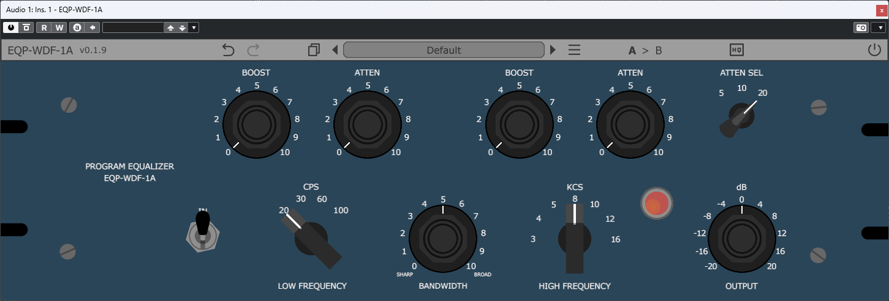
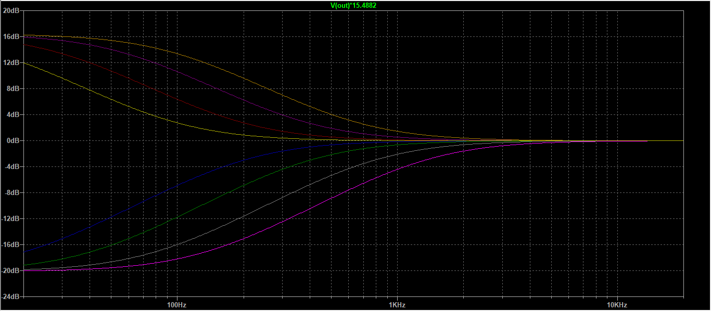
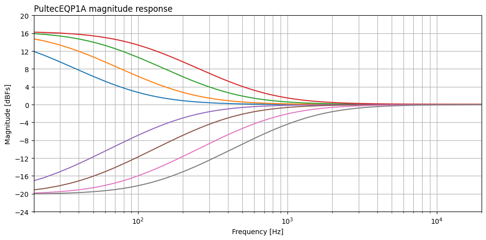
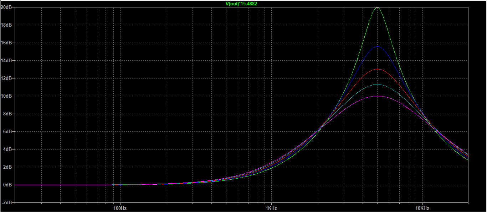
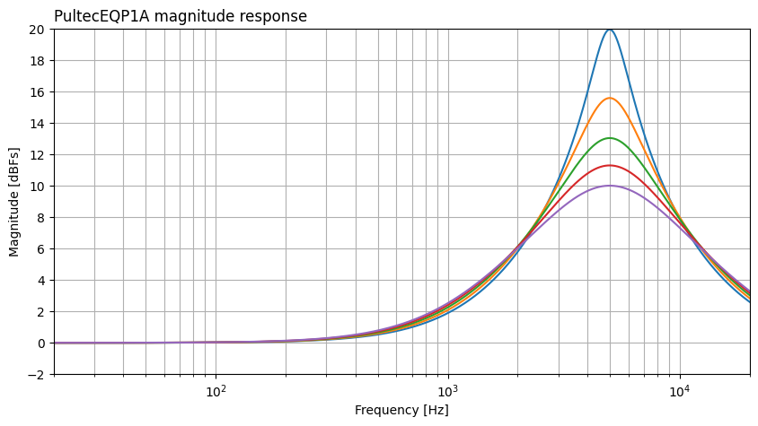
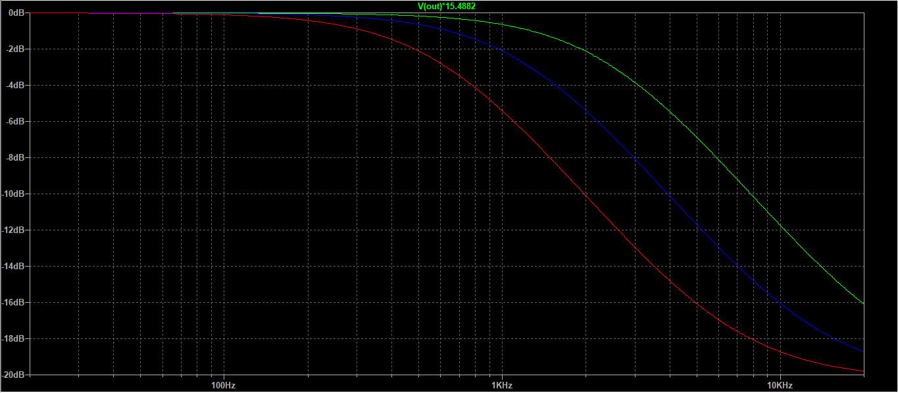
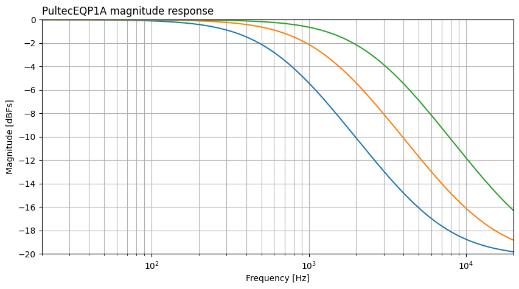
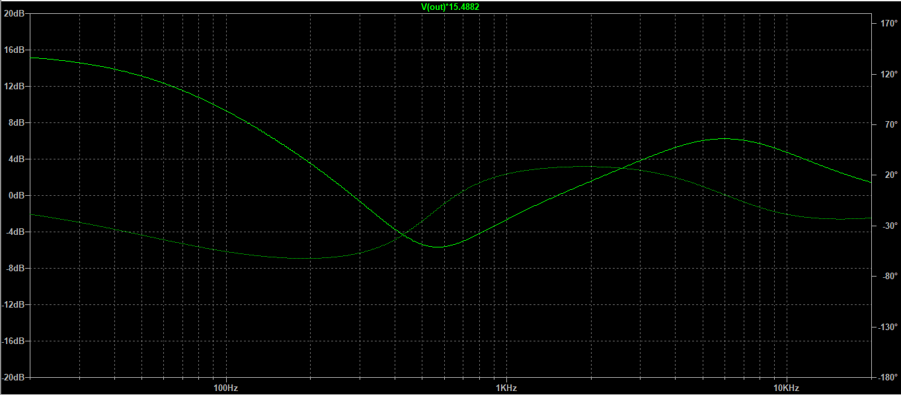
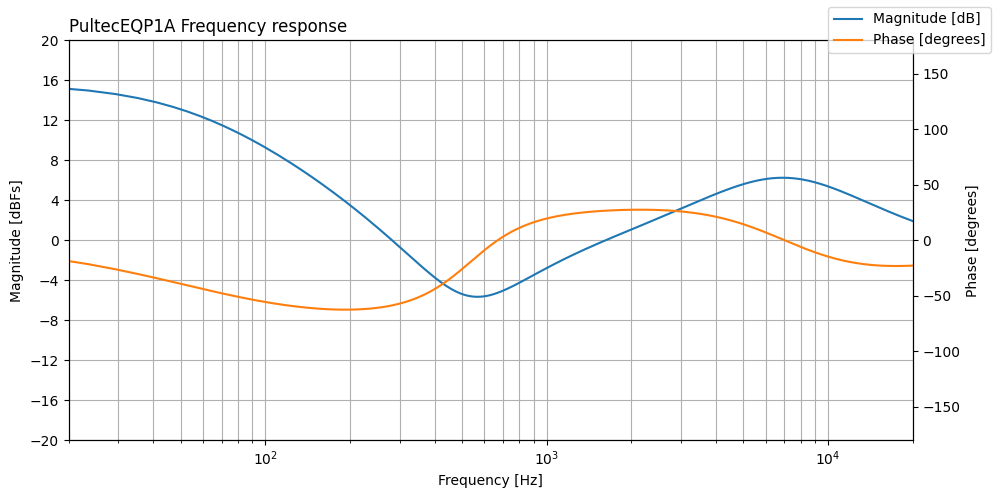

# EQP-WDF-1A
### Pultec EQP-1A emulation using Wave Digital Filters.

## Summary

This repository contains the source code and binaries for an audio plug-in modeling the circuit of the Putlec EQP-1A studio equalizer. The virtual analog model was developed using Wave Digital Filters (WDF) and the resulting model was integrated into an audio plug-in using the JUCE framework.

  

  <em>GUI of the EQP-WDF-1A VST3 plug-in.</em>

The plug-in is available in VST3 format or can be compiled into other formats from the Projucer.

## The Pultec EQP-1A

The Pultec EQP-1A is a classic analog equalizer that has been widely used in the music industry since its introduction in the 1950s. It is renowned for its unique sound and musicality, making it a favorite among audio engineers and producers.

> The low-frequency section of the EQP-1A is a shelving EQ, providing four selectable frequency bands at 20, 30, 60 and 100Hz. These frequencies can be boosted to a maximum of 13.5dB and attenuated (cut) by 17.5dB. Sound engineers long ago discovered that interesting (and useful) equalization curves could be achieved by simultaneously boosting and cutting at the same time, as the boost and cut frequencies overlap.  
> 
> This has become known as the ‘low-end trick’. On a bass drum, for example, if 30Hz is simultaneously boosted and cut, the curve created gives a boost at 80Hz with a dip at around 200Hz – a very pleasing curve on some bass drums. The sound can be further sweetened using the high-frequency controls.  
> 
> The Pultec’s high-frequency section features a boost-peaking EQ and offers seven centre frequencies – at 3, 4, 5, 8, 10, 12 and 16kHz – which can be boosted by up to 18dB, while a Bandwidth control alters the Q of the equalization curve from sharp to broad. The high frequencies can also be cut at 5, 10 and 20kHz. This is a shelf-cut with up to 16dB of attenuation available.
> 
> <small> <small> *Taken from <a href="https://musictech.com/reviews/pultec-eqp-1a"> MusicTech</a>* </small> </small>

  

  <em>Pulse Technique's EQP-1A hardware unit.</em>

## How to model the EQP1A?
  
  To model the EQP1A circuit, first I compiled a few schematics of the unit that can be found online, and then I setup a simulation of the circuit in LTSpice. <!---The schematic files used for the LTSpice simulations are included in the [`/CircuitSim`](CircuitSim) folder. --->

  After some adjustments in the values of the elements of the circuit to get the frequency response as close as possible to [the original unit's one](https://www.soundonsound.com/reviews/pulse-techniques-eqp-1a) the circuit was implemented using Python and Gus Anthon's [pywdf library](https://github.com/gusanthon/pywdf).

  

  <em>WDF structure used for the modeling of the circuit.</em>

  The comparison between the frequency response of the LTSpice simulation and Python implementation is included below.

---

  
  

  <em>Full boost and cut curves for the selectable low frequencies (20 Hz, 30 Hz, 60 Hz y 100 Hz).</em>

---

  
   

  <em>Curves for the high frequency boost at 5 kHz for different bandwidths.</em>

---

  
  

  <em>Full cut curves for the selectable high frequencies (5 kHz, 10 kHz, 20 kHz)</em>

---

  
  

  <em>Frequency response for the EQP1A simulation and the prototype with the same configuration.</em>

---
 
  Once the prototype is working as expected, the model needs to be ported to C++ to be able to compile it into a VST3 plugin that can run in a DAW. To do this, I used the [JUCE framework](https://juce.com) and [Chowdsp's WDF library](https://github.com/Chowdhury-DSP/chowdsp_wdf) to take care of the WDFs part in C++. For the WDF model to behave as expected at audio sample rates, oversampling is necessary.

## Installation
To install the plugin, follow these steps:
1. Download the VST3 release from the [`/Release`](Release) folder.
2. Extract the ZIP file to your VST3 plugin directory.
3. Open your DAW and scan for new plugins.
4. Load the plugin into an audio track.

<!--## Development

To build the plugin from source, follow these steps:
1. Clone the repository: `git clone https://github.com/ABsounds/EQP1A-WDF`
2. Open the `EQP-WDF-1A.jucer` file in the Projucer application.
3. Configure your build settings and export the project to your preferred IDE or build system.
4. Build the project and run the plugin in your DAW.

-->

## Contributing

Contributions to this project are welcome! If you find any issues, have suggestions for improvements, or would like to add new features, please submit a pull request.

## Acknowledgements

This project was developed as my Master's Thesis in [Sound and Music Computing at Pompeu Fabra University](https://www.upf.edu/web/smc). Special thanks to [Xavier Lizarraga](https://www.linkedin.com/in/xavi-lizarraga-b1854751/) for proposing such an interesting topic and supervising my work throughout the process.

The following resources were used in the development of this project:
- [pywdf](https://github.com/gusanthon/pywdf) was used for the WDF Python prototyping.
- [chowdsp::wdf](https://github.com/Chowdhury-DSP/chowdsp_wdf) was used for the C++ implementation of the circuit.
- [R-Solver](https://github.com/jatinchowdhury18/R-Solver) was used to compute the scattering matrix for the R-Type implementation.
- [JUCE](https://juce.com) was used for the development of the VST3 plugin.
